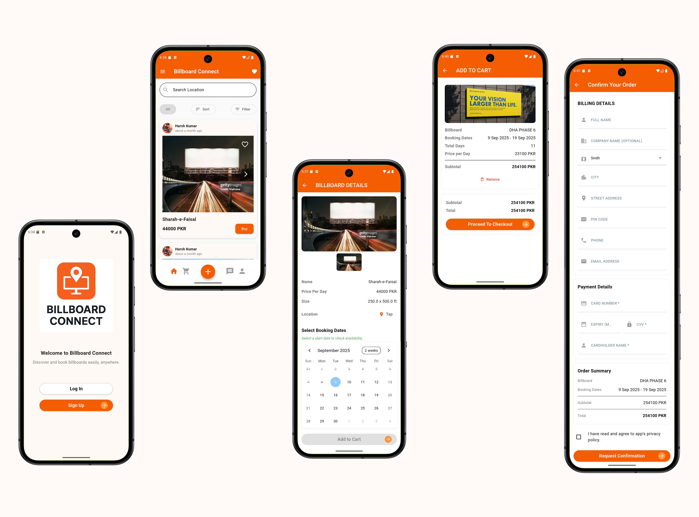
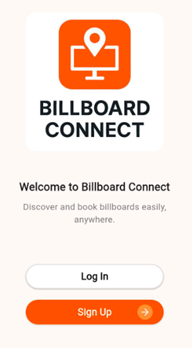
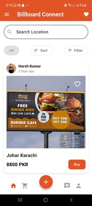
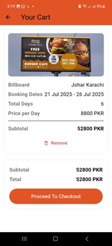
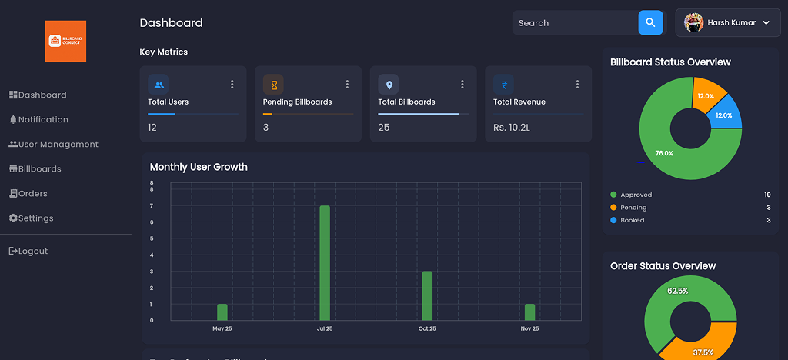
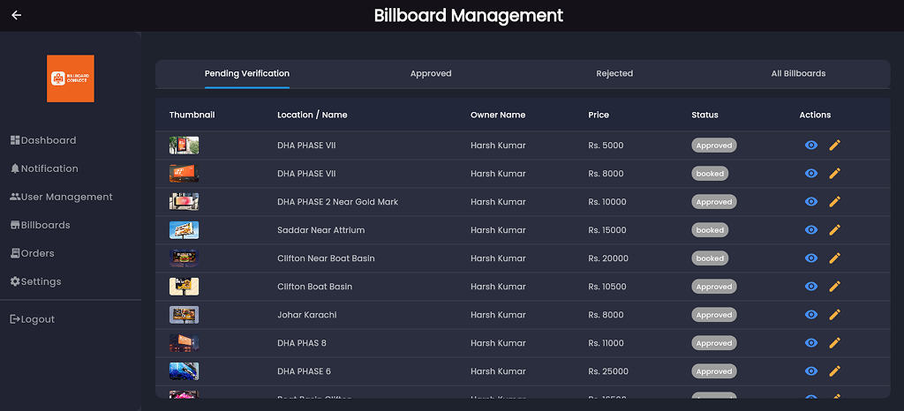
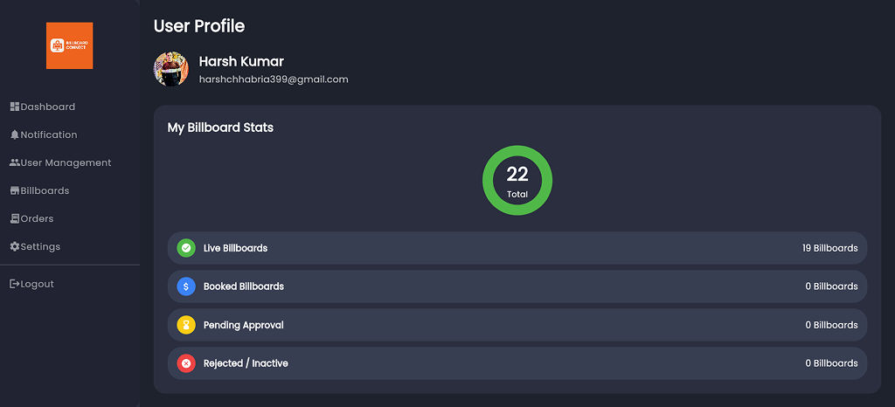

# Billboard Connect – Full-Stack Mobile & Admin 📊

### Description
Billboard Connect is a cross-platform application that streamlines outdoor advertising by connecting **billboard owners** and **advertisers**.  
The platform allows owners to list advertising spaces with details like location, size, availability, and pricing. Advertisers can browse, filter, and book billboards for their campaigns.

The system includes:
- Secure document verification for billboard postings
- Real-time booking status updates
- Integrated payment handling

With a focus on **user-friendliness** and **transparency**, Billboard Connect simplifies the advertisement booking process and enhances accessibility for all stakeholders, including the **admin**, who manages the entire system via a web panel.

---

### Screenshots

### APP UI
  
  
  
  
### Dashboard UI

---

### Key Features

- **Dynamic Billboard Listings**  
  Owners can post and edit billboards with detailed info (location, size, pricing, availability).  
  Advertisers can browse, filter, and search listings easily.

- **Real-Time Booking System**  
  Advertisers can book billboards instantly, with admin approval for authenticity.

- **Integrated Payments**  
  Secure transactions for bookings with multiple payment methods.

- **Admin Panel**  
  Centralized web panel for admin to manage users, billboards, bookings, payments, feedback, and notifications.

- **Wishlist & Feedback**  
  Users can save desired billboards for later and provide ratings and comments on listings and app experience.

- **Notifications & Alerts**  
  Real-time notifications for bookings, payments, and other activities.

- **User-Friendly UI**  
  Clean, responsive interfaces for both mobile and admin platforms.

---

### Core Technologies

- **Platform:** Flutter (iOS & Android), Web Admin Panel
- **Backend:** Firebase (Authentication, Firestore, FCM)
- **Media Handling:** Cloudinary for images and media storage
- **State Management:** Riverpod / Provider
- **Navigation:** GoRouter / Web Routing
- **Notifications:** Firebase Cloud Messaging (FCM)

---

### Data Models

- **User:** Advertiser, Billboard Owner, Admin
- **Billboard:** Location, dimensions, price, availability, owner
- **Booking:** Tracks billboard reservations and status
- **Payment:** Handles transactions linked to bookings
- **Feedback:** User ratings and comments for billboards
- **Wishlist:** Tracks billboards saved by users  